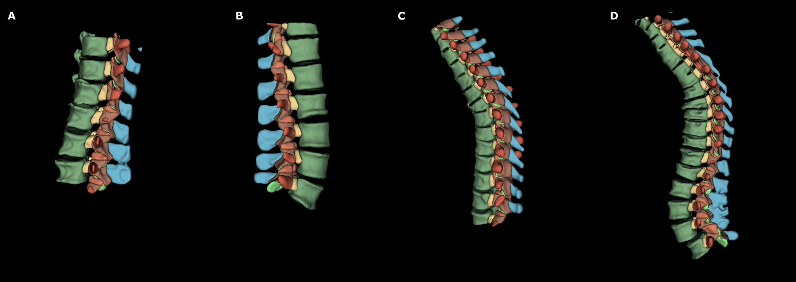

# Spine_Subregions

**Fully automated segmentation of anatomical subregions of the thoracolumbar spine on CT using nnU-Net.**

[](https://www.python.org/)
[](https://github.com/MIC-DKFZ/nnUNet)
[](LICENSE)

---

## Overview

This repository provides a trained nnU-Net model for semantic segmentation of seven anatomical subregions of the vertebral column on thoracolumbar CT scans. The model was developed at the [Machine Intelligence in Clinical Neuroscience (MICN) Laboratory](https://www.micn-lab.com), University Hospital Zurich.

Rather than segmenting the vertebrae as a single structure, this model differentiates between seven anatomically distinct subregions per vertebral level, enabling more granular analysis for surgical planning, radiomic feature extraction, and patient education.



**Segmented subregions:**
- Vertebral body corpus
- Pedicles
- Lamina
- Spinous process
- Transverse process
- Superior articular process
- Inferior articular process

---

## Performance

Evaluated on a held-out test set of 23 thoracolumbar CT scans (Dice score, mean ± SD):

| Structure | Dice Score |
|---|---|
| Vertebral body corpus | 0.982 ± 0.011 |
| Pedicles | 0.942 ± 0.029 |
| Lamina | 0.951 ± 0.024 |
| Spinous process | 0.943 ± 0.028 |
| Transverse process | 0.949 ± 0.028 |
| Superior articular process | 0.927 ± 0.042 |
| Inferior articular process | 0.923 ± 0.038 |

Average inference time per scan: **32.7 seconds** on an NVIDIA A6000 GPU.

---

## Requirements

- Python 3.9+
- [nnU-Net v2](https://github.com/MIC-DKFZ/nnUNet)
- NVIDIA GPU with ≥8 GB VRAM (recommended: 16+ GB for full-resolution 3D inference)
- ~5 GB disk space for model weights

---

## Installation

**1. Install nnU-Net following the official instructions:**
```bash
pip install nnunetv2
```

**2. Set the required nnU-Net environment variables:**
```bash
export nnUNet_raw="/path/to/nnUNet_raw"
export nnUNet_preprocessed="/path/to/nnUNet_preprocessed"
export nnUNet_results="/path/to/nnUNet_results"
```

**3. Download the model weights** from the [Releases](../../releases) page and place them in your `nnUNet_results` folder following the standard nnU-Net directory structure.

---

## Inference

Inputs must be CT scans in **NIfTI format** (`.nii` or `.nii.gz`). Voxel spacing does not need to be resampled manually — nnU-Net handles resampling internally.

**Run inference on a folder of CT scans:**
```bash
nnUNetv2_predict \
    -i /path/to/input_folder \
    -o /path/to/output_folder \
    -d DATASET_ID \
    -c 3d_fullres \

```

**Single file inference:**
```bash
nnUNetv2_predict \
    -i /path/to/input_folder \
    -o /path/to/output_folder \
    -d DATASET_ID \
    -c 3d_fullres
```

Output segmentation masks use the following label convention:

| Label | Structure |
|---|---|
| 0 | Background |
| 1 | Vertebral body corpus |
| 2 | Pedicles |
| 3 | Lamina |
| 4 | Spinous process |
| 5 | Transverse process |
| 6 | Superior articular process |
| 7 | Inferior articular process |

For full documentation on nnU-Net inference options, see the [official nnU-Net repository](https://github.com/MIC-DKFZ/nnUNet).

---

## Training Data

The model was trained on 118 thoracolumbar CT scans from the publicly available [VerSe dataset](https://github.com/anjany/verse) (Sekuboyina et al., 2021), split as follows:

- **Training:** 76 scans
- **Validation (during training):** 19 scans
- **Test set:** 23 scans


---

## Model Architecture

The model uses the **3D full-resolution nnU-Net** configuration, a self-configuring U-Net framework that automatically adapts network architecture and hyperparameters to the dataset.

Key training parameters:
- Epochs: 1000
- Initial learning rate: 0.01
- Activation function: Leaky ReLU (negative slope: 0.01)
- Loss function: Dice + cross-entropy
- Patch size: 192 × 128 × 96
- Batch size: 2
- GPU: NVIDIA A6000 (48 GB VRAM)

---


---

## License

This project is licensed under the MIT License. See [LICENSE](LICENSE) for details.

---

## Contact

For questions or issues, please open a GitHub issue or contact the corresponding author:

**Raffaele Da Mutten, MD**
Machine Intelligence in Clinical Neuroscience (MICN) Laboratory
Department of Neurosurgery, University Hospital Zurich
raffaele.damutten@usz.ch
